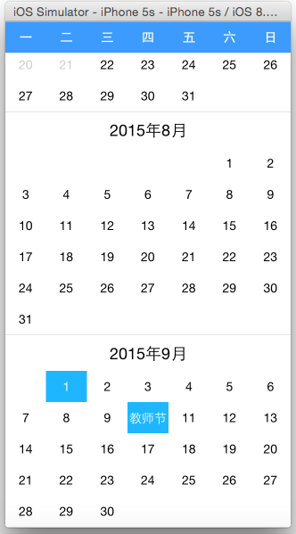

# react-native-calendar
React-Native日历组件

###一、安装

    npm install rn-calendar

###二、效果

###三、用法指南
（1）示例Demo

    var React = require('react-native');
    var Calendar = require('rn-calendar');

    var{
      View,
      AppRegistry,
      StyleSheet,
      StatusBarIOS
    } = React;

    StatusBarIOS.setHidden(true);

    var Index = React.createClass({
      render: function(){
        var holiday = {
          '2015-10-1': '国庆节',
          '2015-9-10': '教师节',
          '2016-1-1': '元旦节',
          '2015-11-11': '双十一'
        };
        var check = {
          '2015-10-1': 'checked',
          '2015-9-1': 'checked',
          '2015-7-10': 'checked',
          '2015-9-10': 'checked'
        };
        var headerStyle ={
          backgroundColor: '#3C9BFD',
          color:'#fff',
          fontSize: 15,
          fontWeight:500,
        };
        return (
          <View style={styles.container}>
            <Calendar
              touchEvent={this.press}
              headerStyle={headerStyle}
              holiday={holiday}
              check={check}
              />
          </View>
        );
      },

      press: function(str){
        alert(str);
      }
    });

    var styles = StyleSheet.create({
      container: {
        flex: 1,
        backgroundColor:'blue'
      }
    });

    AppRegistry.registerComponent('reactCalendar', () => Index);

 （2）属性

    touchEvent：用户点击时获取的时间，可选
    headerStyle：星期条的颜色和字体样式设置， 可选
    holiday: 需要显示的节假日， 可选
    check: 需要选中的日期，可选

